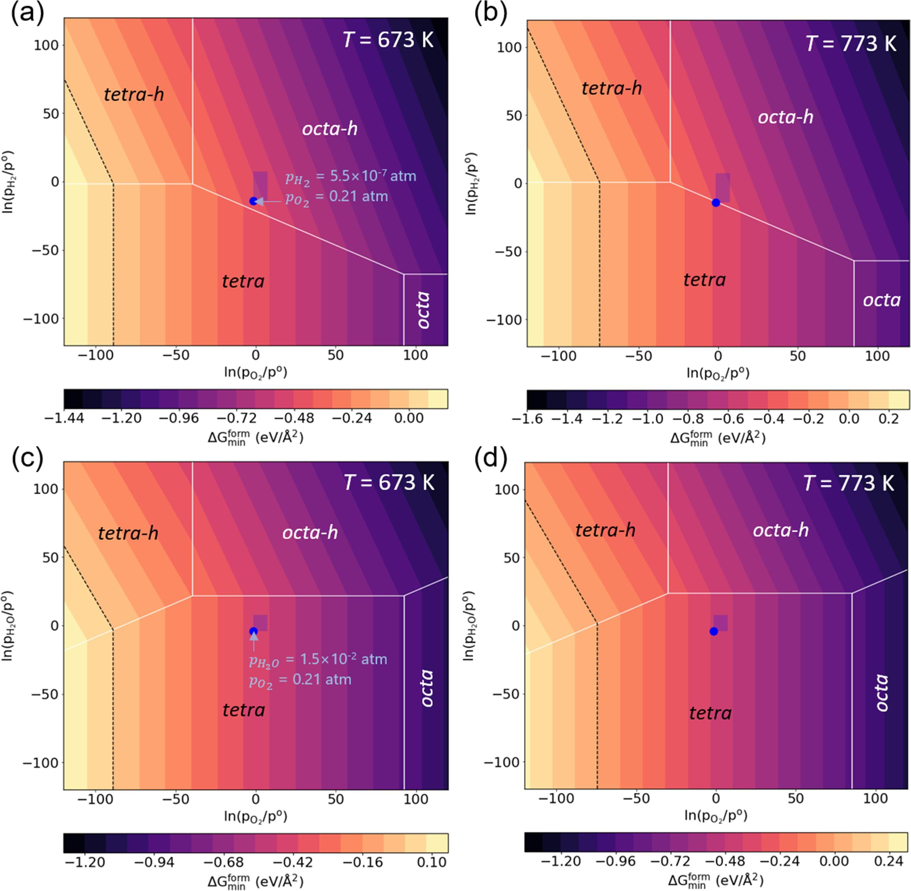

# Introduction
The codes here are python codes (Jupyter Notebook) to visualize the stabilities of several SCR catalysts with different VOx structures. The stability, or the Gibbs free energy of formation (&Delta;*G*form), which was calculated by density functional theory (DFT), is plotted in the form of three-dimensional phase diagram (contour plot). The stability was plotted with respect to temperature (*T*) and partial pressures (*p*i) of gases.

	

image ref: *Appl. Surf. Sci.* **2021**, 552, 149462.

The image above shows that which structure among the considered four models (*tetra*, *tetra-h*, *octa*, and *octa-h*) is thermodynamically the most favorable at a particular set of *T* and *p*i. The scientific details of this code can be found in the [paper](https://doi.org/10.1016/j.apsusc.2021.149462).

## Application of This Code
This code has been utilized in the following published paper:
1. D. Shin, M. H. Kim, and J. W. Han, *Appl. Surf. Sci.* **2021**, 552, 149462 (https://doi.org/10.1016/j.apsusc.2021.149462)
